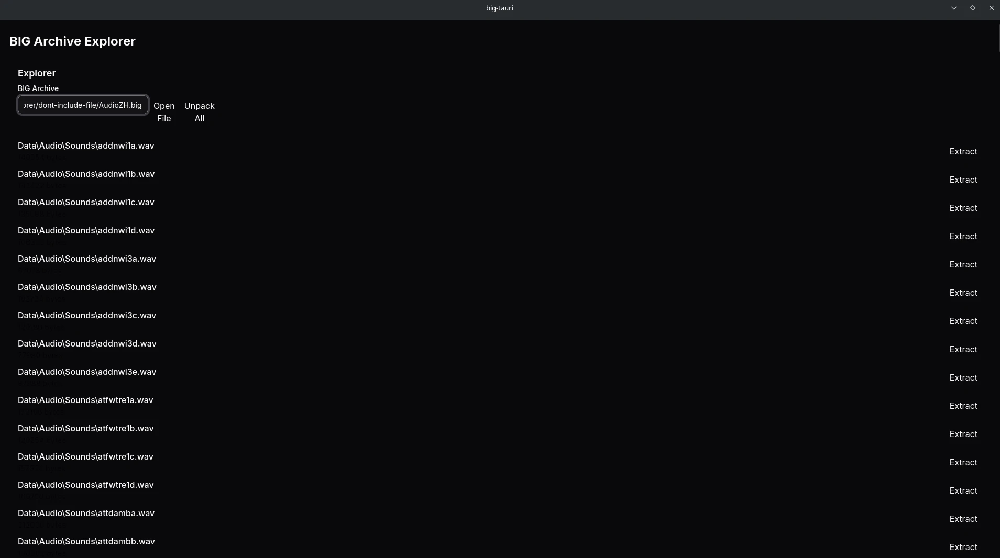

# ZeroHour BIG Explorer

Lightweight Tauri-based tool for exploring, extracting, and repacking `.BIG` archives used by Command & Conquer: Generals – Zero Hour.

See the project Constitution for goals, principles, and safety rules:

- [.github/CONSTITUTION.md](.github/CONSTITUTION.md)

Getting started

1. Install prerequisites (see Tauri docs).
2. Build and run with the standard Tauri workflow.

Gui Interface 



Quick CLI examples

```bash
# List entries
cargo run -p big-cli -- list AudioZH.big

# Extract single file
cargo run -p big-cli -- extract AudioZH.big "Data/Audio/Sounds/foo.wav" -o ./foo.wav

# Unpack entire archive
cargo run -p big-cli -- unpack AudioZH.big -o ./output

# Pack a directory into new archive
cargo run -p big-cli -- pack ./extracted -o ./new.big

# Append a file to archive (requires --force to overwrite)
cargo run -p big-cli -- append ./new.big ./extra/bar.wav --path Data/Audio/Sounds/bar.wav --force
```

Contributions

Please follow the repository contribution guidelines and include tests for parser or IO changes.
